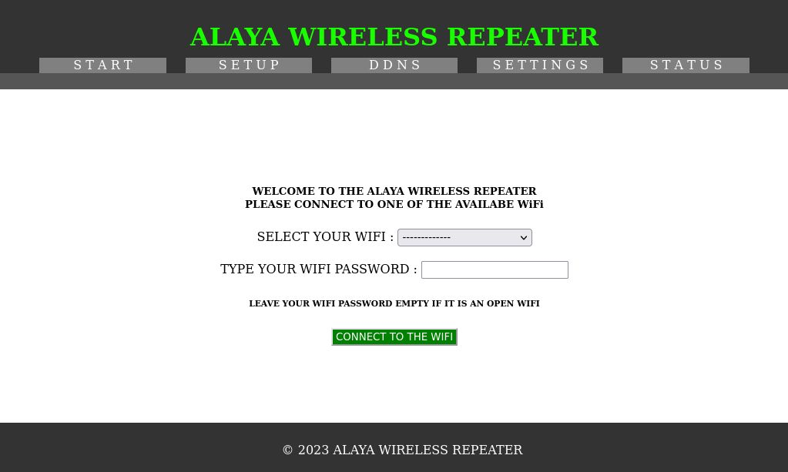
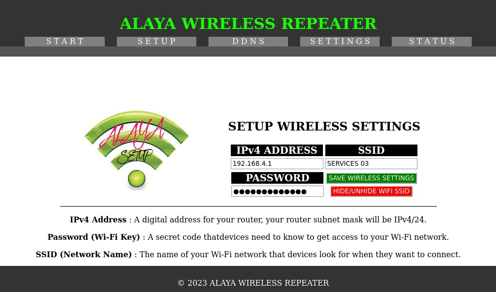
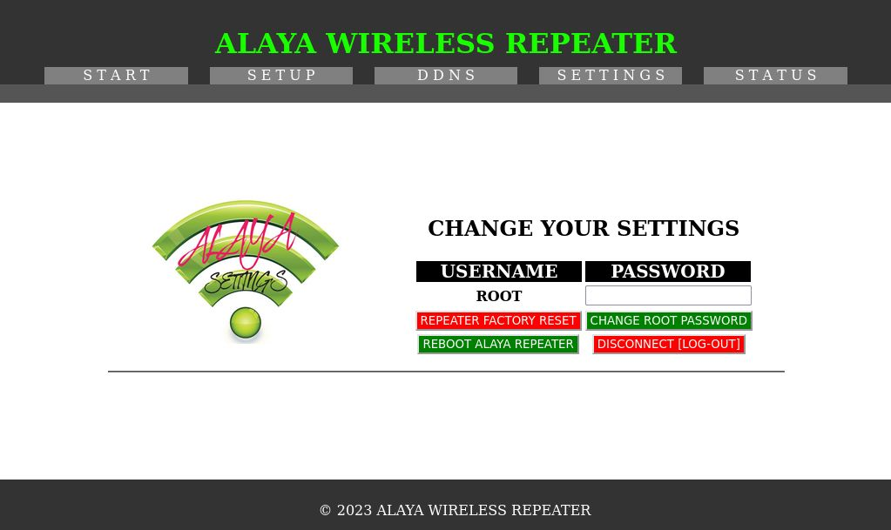

# Router-Honeypot-Wireless-Repeater
Alaya Wireless Router Repeater Honeypot

Hello, I'm Yakin, and I'd like to introduce you to my Wireless Router Honeypot. 

This honeypot is designed to capture data and activity, which is then stored in separate SQLite3 databases for each attempted interaction. It records various settings and details associated with each attempt.

# SCREENSHOTS

